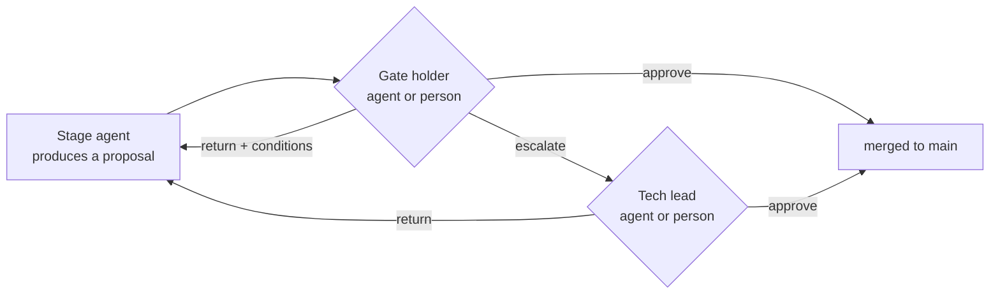
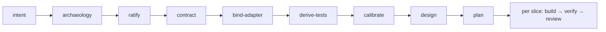
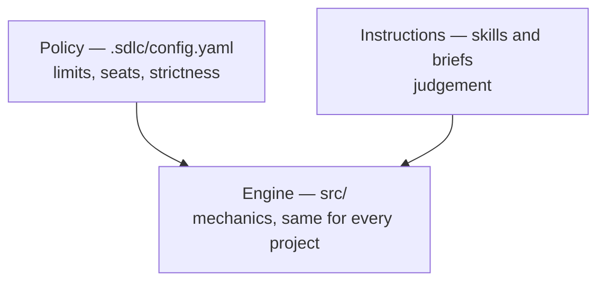
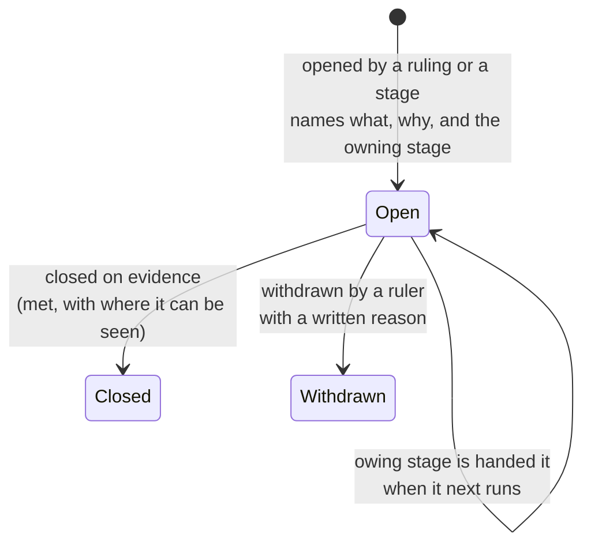

# Operating model

Who does the work, who judges it, what a person sees, and what the pipeline owes itself
between stages. This is the reference for the concepts; the reasoning behind each choice is in
`docs/decisions/`, and the behaviour of each command is in `docs/stages/`. Sections marked
**Decided, not yet built** describe agreed direction that the code does not carry yet.

## 1. Vocabulary

| Term | Meaning |
|---|---|
| **Stage** | One step of the pipeline, run by `sdlc run <stage>`. A stage is always done by an agent working in a sealed workspace, and its output becomes a proposal. |
| **Proposal** | A branch holding a stage's output and a page that leads with the question to be decided. |
| **Gate** (checkpoint) | The point where a proposal is ruled on. Each gate has a code: G0 intent, G1 ratify, G-DESIGN design, G2 plan, G3 review, G-POL policy. |
| **Seat** | The place at a gate from which a ruling is made. A seat is a *role*, and the project's config binds the role to a persona agent or to a person. |
| **Holder** | The role that rules first at a gate. |
| **Escalation target** | The role a gate hands a question to when its holder will not or may not rule it (`escalate_to`). |
| **Persona agent** | An agent sitting in a seat, working from a written brief (`.sdlc/personas/<role>.md`): what it cares about, what it must refuse, when it must escalate. |
| **Ruling** | `approve`, `return` (sent back with conditions) or `escalate`. Every ruling records which kind of seat made it: a persona agent, a person, or the runner itself. |
| **Condition** | An instruction attached to a return. It stays owed until a later ruling records it met or withdrawn, with a reason. |
| **Contract** | The menu a blind test may use: the pages and actions it can drive, the seeded data it starts from, and what it can observe afterwards (sent mail, files, notifications). Written by the `contract` stage from the old application, ratified at G1, and shared by both targets so one test runs against either. The seed is SQL loaded into a target's database; the old application's code is never changed. |
| **Operator** | Whoever types the next `sdlc` command. |

## 2. Work and judgement

Work is always done by agents. Judgement is done from seats, and each seat is filled by an
agent or a person as the project's config says.

| Stage | What its agent produces |
|---|---|
| `intent` | The problem and outcome |
| `archaeology` | Requirements recovered from the old application, one domain at a time |
| `ratify` | The ruled set of criteria |
| `contract` | The menu above |
| `bind-adapter` | The binding of that menu to a running target |
| `derive-tests` | One blind acceptance test per criterion |
| `calibrate` | The suite run against the old application, to show the tests are right |
| `design` | The component catalogue |
| `plan` | The slices, each answerable for a set of criteria |
| `build` | Application code for one slice |
| `verify` | The acceptance suite run against the built slice |

The seats are distinct roles with distinct briefs, not one generic reviewer:

| Seat | Judges |
|---|---|
| product owner | whether the problem is the right one (G0), and whether each criterion is the contract or a defect (G1) |
| UX reviewer | the design catalogue (G-DESIGN) |
| architect | the plan (G2) |
| reviewer | a built slice against its criteria and its verify result (G3) |
| tech lead | changes to the pipeline's own policy (G-POL), and every question another seat escalates |

## 3. Live operation and simulation

The seats are the same in both modes. What changes is who fills them.

| | Live operation | Full simulation |
|---|---|---|
| Stage work | agents | agents |
| Gate holders | each gate, agent or person, as config says | persona agents |
| Tech lead (escalation target) | a person | a persona agent |
| Weekly sample of agent rulings | a person spot-checks it | listed on the state site, nothing waits on it |

A project declares the tech-lead role simulated by giving G-POL to `agent:tech-lead`. From
then on an escalation is ruled by the tech-lead persona, which may rule any escalation it did
not raise itself.

**When a real person is reached in full simulation.** Only at a dead end: when every seat
entitled to rule has escalated, and the rules leave no agent entitled to rule
(`docs/decisions/0039-an-escalation-that-reaches-nobody.md`). The proposal then stops and
waits for a person typing `sdlc rule <name> approve|return --by <role>`. That ruling is
recorded as a person's.

Any gate can be moved from an agent to a person, or back, by editing the config. That edit is a
policy change and belongs at G-POL.

## 4. The sequence

Every stage reads its inputs from `main` and can be run again at any time. Going backwards is
safe: a changed criterion bumps its version, tests written against the older version are
marked stale, and a slice that claims a stale criterion cannot pass verify.

## 5. Three layers

Every rule the pipeline applies belongs to exactly one layer.

| Layer | Lives in | Holds | Changed by |
|---|---|---|---|
| **Engine** | `src/` | Mechanics identical for every project: running a stage, sealing its workspace, recording rulings, keeping the lists of what is owed, routing requests. No opinion about what is acceptable. | a pipeline release |
| **Policy** | the project's `.sdlc/config.yaml` | Values a project could reasonably want different: who holds each gate, escalation, sampling, turn budgets, retry and loop limits, strictness of checks. | a G-POL ruling |
| **Instructions** | stage skills and persona briefs | Judgement: how an agent should do its work, and what a seat should accept as evidence. | the project, with its own copy of a skill or brief |

The test for a new rule: if two projects could reasonably want it different, it is policy; if
it is a matter of judgement, it is an instruction; only what must hold for every project is
engine.

**Where each kind of rule lives.** The limits and permissions a project could want different are
config keys with defaults the engine applies when they are absent (`docs/config.md`, `policy`):
how many times verify returns a slice before escalating, how many follow-up rulings ratify gives a
domain and whether it then escalates (the default) or drops what is unresolved, how many times an
adapter is rebound, a test re-derived, a requirement re-recovered or a stage sent back by one line of
work before what the owing stage produces is escalated (section 6), how many repair
turns a stage gets after a failed post-check, which tiers force an escalation and which block an
unverified test (both always including CRITICAL), whether G3 may approve a build on criteria
nobody asserted, each stage's turn ceiling (`policy.turns`), and which egress rules the egress
check applies. Keys the schema accepts and nothing reads (`policy.triage`, `policy.rungs`) are
marked reserved, and `sdlc checks` says so when they are set. Verify refuses to run when G3
names no escalation target, ratify refuses to run past its follow-up limit when G1 names
none, and a stage handed owed work past its limit refuses to run when its gate names none. A proposal that changes the config's `policy` block is ruled at G-POL only, and its seat
is checked against the policy on `main`. A project can supply its own copy of a stage skill
(`.sdlc/skills/<stage>.md`), and the judgement a stage works by is in its skill rather than its
prompt. A persona brief names only escalation triggers the persona can act on.

Risk tiers exist in the schema and in the criteria format, but nothing passes a criterion's
tier to the proposals that touch it, so tier-based escalation does not fire. They stay dormant
and documented as inactive (`docs/config.md`, "Risk tiers"), and are removed if they remain
unused.

## 6. What is owed

Several things the pipeline asks for are owed across runs: a ruling's condition, a request a
ruling addressed to another stage, a test to re-derive, an adapter to rebind, a requirement to
recover again. They are one mechanism in the engine (`src/spec/owed.mjs`): one list of entries,
each with a kind, kept on `main` in the project. When a stage starts, what it owes is read from
`main` and put in front of its agent, and the ruler of the resulting proposal is shown the same
list.

Every entry has the same shape: what is owed, the stage that owes it, why, in the words of whoever
asked, who opened it at which ruling, and whether it is open, closed as met with the evidence, or
withdrawn with the reason. A kind adds what it needs beside those, such as the criterion version a
re-derivation was asked at.

| Kind | Opened by | Owed by | Closed by |
|---|---|---|---|
| `condition` | a plain condition on a return | the stage the proposal goes back to | a later ruling's `condition-met` or `condition-withdrawn` |
| `request` | `addressed-to <stage>: <why>` on a return | that stage's `--revise` run | the run that takes it up; a request cannot be withdrawn |
| `redo` | `test-wrong` at calibration, `test-overreaches` on a return | `derive-tests --stale` | the run that derives the test again |
| `rebind` | `adapter-wrong` in a calibration's triage | `bind-adapter` for that target | `calibrate`, once the adapter has changed |
| `recovery` | `recovery-wrong` at ratification | `archaeology` for that domain | the run that recovers the criterion again |

Each kind is stored in its own file (`.sdlc/conditions.yaml`, `.sdlc/revision-requests.yaml`,
`tests/acceptance/redo.yaml`, `tests/adapters/rebind.yaml`, `spec/recovery.yaml`), and a kind with no
file of its own shares `.sdlc/owed.yaml`, so a new kind needs no new machinery
(`docs/decisions/0044-owed-work-is-one-list-kept-where-each-kind-lives.md`). A condition is never a
reason to start a run: only a request opens a `--revise` run by itself.

Nothing is removed. A closed entry stays on file, and an item asked for again is a new entry, so the
list says how many times each item has been sent. The sending loops are bounded in policy
(`policy.loops.rebind`, `redo`, `recovery` and `request`, two by default): a run handed an item sent
more times than that still does the work, and the proposal it opens is escalated by the runner to
its gate's escalation target rather than put to the gate holder for another round.

## 7. A requirement with no test

The test writer is blind: it sees the criterion and the contract, never the code. When the
contract gives it no way to reach or observe what a criterion describes, it records the
criterion as untestable, with the reason and what would unblock it.

In practice most such records are **not yet testable** rather than untestable: the seed has no
record in the state the test needs, or the contract's observations are too thin (a mail
observation that exposes the subject and recipient but not the body). A few are about the
inside of the system or about proving that something never happens, and cannot be observed from
outside at all.

**Decided, not yet built.** A missing test is an owed item (section 6):

- The record must name what is missing and which stage owns supplying it. The pipeline keeps
  no list of reasons; a new kind of blocker needs no new rule.
- The item stays open until a test that runs exists, and a slice is not done while one of its
  criteria is open. Whether that blocks approval is policy.
- Proof by other means counts only when it runs: a named test inside the application that
  verify executes and reports. A written assurance never closes the item.
- An item nobody can close is withdrawn by a ruler with the reason written down.

This replaces two alternatives. Escalating by the criterion's risk tier needs something to
assign tiers and a rule for every tier below the threshold. Escalating every untestable record
sends mechanical work to the tech lead. With nothing able to disappear quietly, the ruler is no
longer relied on to notice which omissions matter.

## 8. What runs next

The design defines the phases, their order and their exit criteria. Choosing which stage runs
next is currently done by the operator. The operator is making a decision the pipeline's own
records could settle.

**Decided, not yet built.** `sdlc next` reads the recorded state and names the next stage and
why: phase exit criteria, what each stage owes, stale tests, open proposals, slice order.

- It only reads. Records change only through stage runs and rulings, which are commits.
- Running something other than what `next` named is allowed and recorded, with a required
  reason, so every deviation is visible.
- A change to a record file that did not come from a pipeline commit is flagged by a check.
  Whether the check warns or fails is policy: warn while the pipeline is being developed, fail
  in live operation.

It is triggered by a change of state, never by time: a stage finishing or a ruling being
recorded.

| Level | Behaviour |
|---|---|
| 1 | Every run and every ruling ends by printing what is next. The operator still types the command, but no longer chooses it. |
| 2 | A loop runs whatever is next, and stops by itself at a seat held by a person, a failure, or a dead end. Whether it continues unprompted is policy. |
| 3 | With people in seats, a person's ruling (a pull-request approval) restarts the loop through the repository's workflow. |
